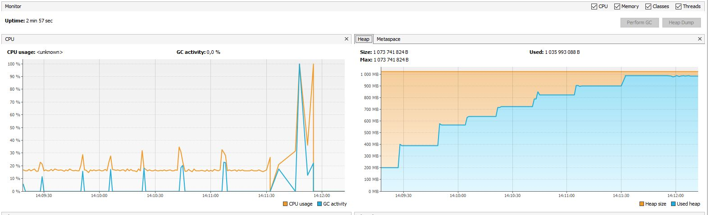

Было исследовано 3 сборщика мусора:
* G1 (-XX:+UseG1GC)
* ShenandoahGC (-XX:+UseShenandoahGC)
* Zero GC (-XX:+UseZGC)

### Максимальный размер кучи 256 Mb
 * **G1**:

* **ShenandoahGC**:

* **ZeroGC**:

|    Сборщик   | Среднее время пауз, ms | Кол-во пауз | Full GC среднее время пауз, ms | Full GC, кол-во | Время работы приложения, мин
| -------------|:----------------------:| -----------:| ------------------------------:| ---------------:| ----------------------------:
| G1           |       54.9             |     188     |           105.5                |       94        |          ~3
| ShenandoahGC |       36.3             |     3883    |           259.9                |       56        |         \> 10
| Zero GC      |       0.44             |     144      |           -                    |       -         |          ~10

### Максимальный размер кучи 1 Gb
* **G1**:
  

* **ShenandoahGC**:
  

* **ZeroGC**:
  

|    Сборщик   | Среднее время пауз, ms | Кол-во пауз | Full GC среднее время пауз, ms | Full GC, кол-во | Время работы приложения, мин
| -------------|:----------------------:| -----------:| ------------------------------:| ---------------:| ----------------------------:
| G1           |       209.7            |     102     |           385.5                |       54        |          ~3
| ShenandoahGC |       575.5            |     400     |           991.3                |       30        |         \> 6
| Zero GC      |       0.43             |     87      |           -                    |       -         |          ~3

*Выводы:*

* На небольшом размере кучи неплохо себя показал как `ShenandoahGC`, так и `Zero GC`.
Второй показал наименьшее время пауз, а также число очисток. Но с `Zero GC` приложение
  упало примерно через 10 минут, при этом с `ShenandoahGC` проработало дольше.
  При использовании сборщика `G1` приложение проработало около 4 минут
  
* При размере кучи в 1GB лучше всего себя показывает `Zero GC`. Однако, при его использовании приложение упало примерно через ~3 минуты 
  (`java.lang.OutOfMemoryError: Java heap space`). При использовании `ShenandoahGC`, если смотреть по графику, с ним память "течет" медленее всего. Наибольшую активность проявляет тогда, когда память практически вся исчерпана.
  
* `Zero GC` предназначен для очень больших хипов — до нескольких терабайт. Цель — гарантировать паузы на сборку мусора на таком хипе максимум 10 миллисекундами. Поэтому на больших хипах применение его оправдано.

В большинстве случаев можно остановить выбор на `ShenandoahGC`, в JDK 8, 11 и 15 он готов для применения в продакшене. 
В целом он показал себя лучше других, т.к. с ним время работы приложения было максимальным. 

**Основное преимущество**:
сократить влияние временных пауз GC на запущенное приложение, выполняя очистку и сжатие без замораживания пользовательских потоков (парралельно, без stop the world пауз).