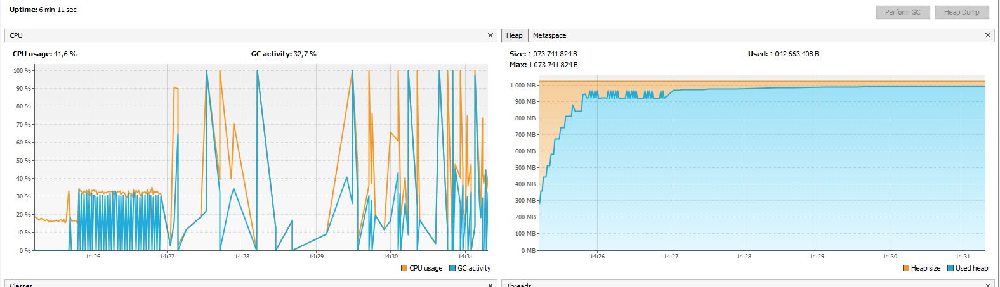

Было исследовано 3 сборщика мусора:
* G1 (-XX:+UseG1GC)
* ShenandoahGC (-XX:+UseShenandoahGC)
* Zero GC (-XX:+UseZGC)

### Максимальный размер кучи 256 Mb
 * **G1**:

* **ShenandoahGC**:

* **ZeroGC**:

| GC Name | Pause GC Time (AVG Time), ms | Full GC (AVG Time), ms | Full GC, count | Concurrent Mark (AVG Time), ms | Concurrent Mark, count | Cleanup (AVG Time), ms | Cleanup, count | Young GC (AVG Time), ms | Young GC, count  | Full Report |
| ------------- |:-------------:| -----:| -----:| -----: |-----:| -----:| -----:| -----:| -----:| -----:
| G1     | 56.9 | 103 | 91 |224  | 7 | 0.125 | 7 | 73.3 | 95 | [link][1]
| ShenandoahGC      | 36.3 | 260 | 56 | 304 | 970 | 0.0285 | 897 | - | - | [link][2]
| Zero GC | 0.146 | - | - | 290 | 144 | 3.49 | 144 | - | -| [link][3]

[1]: https://gceasy.io/my-gc-report.jsp?p=c2hhcmVkLzIwMjEvMDIvNy8tLUcxLmxvZy0tMTQtNDYtMzA=&channel=WEB
[2]: https://gceasy.io/my-gc-report.jsp?p=c2hhcmVkLzIwMjEvMDIvNy8tLVNoZW5hbmRvYWhHQy5sb2ctLTE1LTE3LTE=&channel=WEB
[3]: https://gceasy.io/my-gc-report.jsp?p=c2hhcmVkLzIwMjEvMDIvNy8tLVpHQy5sb2ctLTE1LTMyLTM0&channel=WEB

### Максимальный размер кучи 1 Gb
* **G1**:
  

* **ShenandoahGC**:
  

* **ZeroGC**:
  

| GC Name | Pause GC Time (AVG Time), ms | Full GC (AVG Time), ms | Full GC, count | Concurrent Mark (AVG Time), ms | Concurrent Mark, count | Cleanup (AVG Time), ms | Cleanup, count | Young GC (AVG Time), ms | Young GC, count  | Full Report |
| ------------- |:-------------:| -----:| -----:| -----: |-----:| -----:| -----:| -----:| -----:| -----:
| G1     | 0.25 | - | - | 402  | 1 | 0.185 | 1 | 53.7 | 14 | [link][4]
| ShenandoahGC | 0.339 | - | - | 280 | 5 | 0.0708 | 5 | - | - | [link][5]
| Zero GC | 0.249 | - | - | 278 | 4 | 17 | 4 | - | -| [link][6]

[4]: https://gceasy.io/my-gc-report.jsp?p=c2hhcmVkLzIwMjEvMDIvMjMvLS1nYy0xNzc4NC0yMDIxLTAyLTIzXzE3LTI4LTUxLmxvZy0tMTQtMzItMjg=&channel=WEB
[5]: https://gceasy.io/my-gc-report.jsp?p=c2hhcmVkLzIwMjEvMDIvMjMvLS1nYy0xNDYzMi0yMDIxLTAyLTIzXzE3LTM2LTUxLmxvZy0tMTQtNDMtMzY=&channel=WEB
[6]: https://gceasy.io/my-gc-report.jsp?p=c2hhcmVkLzIwMjEvMDIvMjMvLS1aR0NfMUdCLmxvZy0tMTQtNTMtNg==&channel=WEB

*Выводы:*

* На небольшом размере кучи неплохо себя показал как `ShenandoahGC`, так и `Zero GC`.
Второй показал наименьшее время пауз, а также число очисток. Но с `Zero GC` приложение
  упало примерно через 10 минут, при этом с `ShenandoahGC` проработало дольше.
  При использовании сборщика `G1` приложение проработало около 4 минут
  
* При размере кучи в 1GB все сборщики себя хорошо показали, ниразу не уйдя в FullGC.
Как и `ShenandoahGC`, `Zero GC` показал минимальное количество времени пауз. 
  Лучше всего себя показывает `Zero GC`. Если смотреть по графику, с ним память "течет" медленее всего.
  
* `Zero GC` предназначен для очень больших хипов — до нескольких терабайт. Цель — гарантировать паузы на сборку мусора на таком хипе максимум 10 миллисекундами. Поэтому на больших хипах применение его оправдано.

Дополнительно логи были проанализированы с помощью сервиса [gceasy.io](https://gceasy.io). Ссылка на отчеты также приложена в таблицах.

В большинстве случаев можно остановить выбор на `ShenandoahGC`, в JDK 8, 11 и 15 он готов для применения в продакшене. 

**Основное преимущество**:
сократить влияние временных пауз GC на запущенное приложение, выполняя очистку и сжатие без замораживания пользовательских потоков (парралельно, без stop the world пауз).